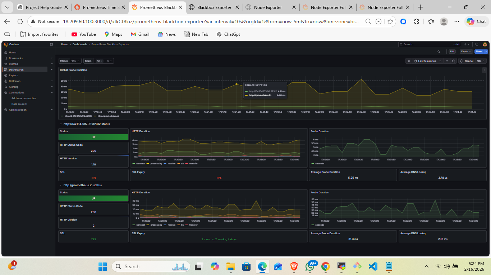
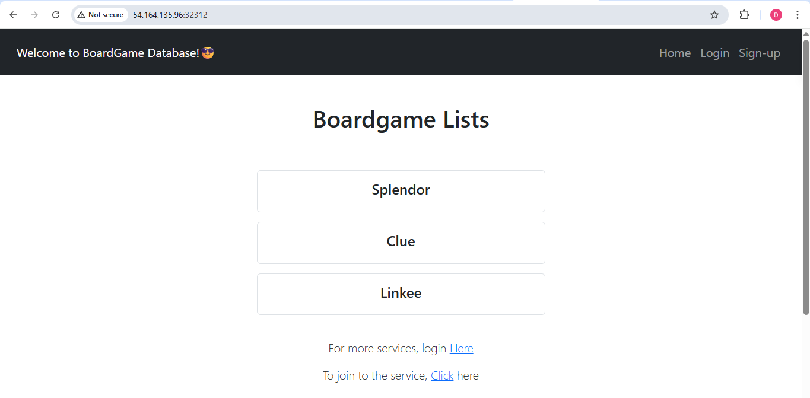

# 🚀 DevSecOps CI/CD Pipeline with Jenkins, SonarQube, Trivy, Nexus, Docker, Kubernetes & Monitoring

This project demonstrates a complete end-to-end DevSecOps pipeline that automatically builds, tests, scans, packages, deploys and monitors a Spring Boot application using modern DevOps tools.

---

## 🧰 Tools & Technologies Used

- Git & GitHub
- Jenkins
- Maven
- SonarQube
- Trivy Security Scanner
- Nexus Repository
- Docker & DockerHub
- Kubernetes (AWS EC2 Cluster)
- Prometheus & Grafana Monitoring
- Blackbox Exporter & Node Exporter

---

## 🔄 CI/CD Pipeline Flow

1. Developer pushes code to GitHub
2. Jenkins triggers pipeline
3. Maven build & test
4. SonarQube code quality analysis
5. Trivy vulnerability scanning
6. Artifact upload to Nexus
7. Docker image build & push
8. Kubernetes deployment
9. Monitoring via Prometheus & Grafana
10. Email notification

---

## 🧪 Jenkins Pipeline

---

## 🔍 SonarQube Quality Gate

---

## 🔐 Security Scan (Trivy)

---

## 📦 Nexus Artifact Upload

---

## 🐳 Docker Image Build & Push

---

## ☸ Kubernetes Deployment

---

## 📊 Monitoring (Prometheus & Grafana)

---

## 📧 Email Notification

---

## 🌐 Application Output

---

## 🎯 Project Outcome

✔ Automated CI/CD Pipeline  
✔ Secure code quality checks  
✔ Vulnerability scanning integrated  
✔ Containerized deployment  
✔ Kubernetes orchestration  
✔ Real-time monitoring & alerting  

---

## 👨‍💻 Author

**Darshan S P**

DevOps | Cloud | Cybersecurity Enthusiast

